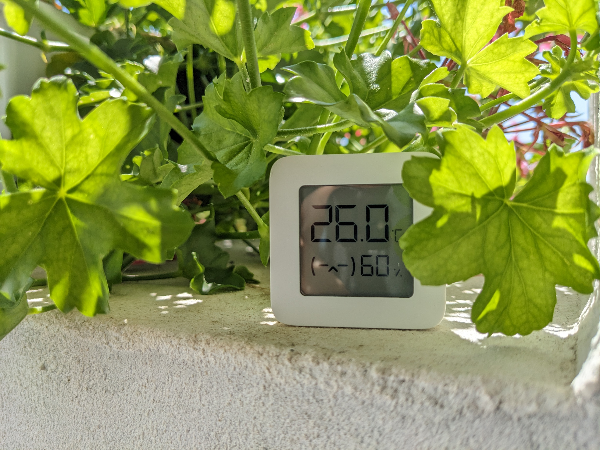
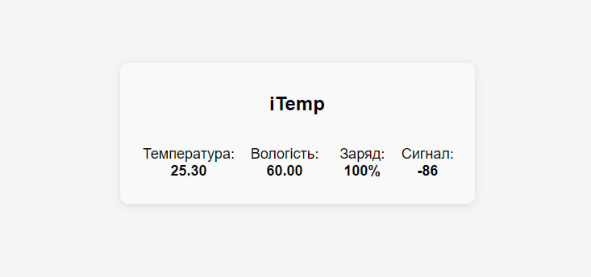

# iTemp - ESP32 Bridge for Xiaomi Mijia 2 Temperature Sensor with Flask Web Interface

This project utilizes an ESP32 microcontroller as a bridge between a Bluetooth Low Energy (BLE) device, specifically the Xiaomi Mijia 2 Temperature Sensor, and a Python server running Flask. The ESP32 acts as a mediator, collecting temperature data from the sensor and forwarding it to the Flask server. The server then displays the temperature readings through a web interface.

## Hardware Requirements
- ESP32 microcontroller
- Xiaomi Mijia 2 Temperature Sensor
- USB cable for ESP32 programming and power
- Computer or device to host the Flask server

## Software Requirements
- Arduino IDE or compatible software for ESP32 programming
- Python 3.x
- Flask web framework
- BLE library for ESP32
- Additional dependencies as specified in the project code

## Installation and Setup
1. Clone or download the project repository to your computer.
2. Set up the ESP32 microcontroller using the Arduino IDE or compatible software. Ensure that the BLE library is installed.
3. Connect the Xiaomi Mijia 2 Temperature Sensor to the ESP32 according to the pin configuration specified in the project code.
4. Connect the ESP32 to your computer using a USB cable for programming and power.
5. Upload the ESP32 sketch from the project repository to the microcontroller.
6. Install Python 3.x on your computer if it is not already installed.
7. Install the required Python packages by running the command `pip install -r requirements.txt` from the project repository.
8. Start the Flask server by running the command `python app.py` from the project repository.
9. Access the Flask web interface by opening a web browser and navigating to `http://localhost` or the appropriate address if hosting the server on a remote device.

## Usage
- The ESP32 will automatically scan for the Xiaomi Mijia 2 Temperature Sensor and retrieve temperature data at regular intervals.
- The temperature readings will be displayed in real-time on the Flask web interface.
- Users can access the web interface to view the current temperature, historical data, and any additional features implemented in the Flask application.

## Contributing
Contributions to this project are welcome. If you encounter any issues or have suggestions for improvements, please submit an issue or pull request on the project repository.

## License
This project is licensed under the [MIT License](LICENSE). Feel free to use and modify the code for your own purposes.
